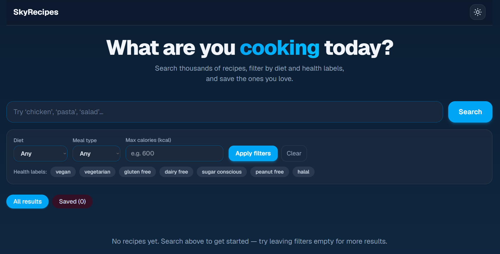

# SkyRecipes

Search thousands of recipes, filter by diet and health labels (including a halal categorization), and save the ones you love.

## Screenshot



## Tech Stack

- **[Next.js](https://nextjs.org)** 16 — App Router
- **[React](https://react.dev)** 19
- **[Tailwind CSS](https://tailwindcss.com)** v4
- **[Edamam Recipe API](https://developer.edamam.com/edamam-docs-recipe-api)** — recipe search & details

## Features

- **Recipe search** — keyword search with pagination ("Load more")
- **Filters** — diet, meal type, max calories, and health-label chips
- **Halal categorization** — every recipe gets a badge: **Halal** / **Check** / **Not halal**, plus a filter chip that hides non-halal results
- **Favorites** — heart any recipe, persisted in `localStorage`
- **State restore** — search, filters, and results survive navigating to a recipe and back
- **Dark / light theme** — toggle in the navbar, follows your OS by default, remembered across visits, no flash on load
- **Responsive UI** — grid, ingredient modal, and full recipe detail page

<!-- Screenshots: drop images here when you have them, e.g.


-->

## Prerequisites

- Node.js 18+
- Free Edamam API credentials → [sign up at developer.edamam.com](https://developer.edamam.com/)

## Getting Started

1. Install dependencies:

   ```bash
   npm install
   ```

2. Create `.env.local` in the project root:

   ```bash
   EDAMAM_APP_ID=your_app_id
   EDAMAM_APP_KEY=your_app_key
   ```

3. Start the dev server:

   ```bash
   npm run dev
   ```

4. Open [http://localhost:3000](http://localhost:3000).

## Project Structure

```
app/
  page.tsx              # Home page (client-only: search, filters, results)
  layout.tsx            # Root layout + pre-paint theme script
  recipe/[id]/page.tsx  # Full recipe detail page (server-rendered)
  api/recipes/route.ts  # Proxy to Edamam (search + by id)
  components/           # RecipeApp, FilterBar, RecipeCard, RecipeModal, Navbar
lib/
  edamam.js             # Edamam API client
  halal.mjs             # Halal classifier + self-check
```

## How Halal Classification Works

Edamam has no halal label (`health=halal` returns 400), so `lib/halal.mjs` classifies each recipe from its title and ingredients:

- **halal** — no red-flag ingredients (vegetarian, fish, clean ingredients)
- **mushbooh** (“Check”) — meat or doubtful ingredients (gelatin, cooking wines, emulsifiers)
- **haram** (“Not halal”) — pork products or alcohol

This is keyword classification, **not certification data**. Run the self-check with:

```bash
node lib/halal.mjs
```

## Scripts

| Command         | What it does              |
| --------------- | ------------------------- |
| `npm run dev`   | Dev server with hot reload |
| `npm run build` | Production build          |
| `npm run start` | Serve the production build |
| `npm run lint`  | Run ESLint                |
| `npm run test:e2e` | Run Playwright e2e + security tests |
| `npm run knip`  | Find unused dependencies and exports |

## Testing

**E2E + security tests** run with [Playwright](https://playwright.dev) against a dedicated dev server on port `3100` (started automatically — port `3000` is skipped to avoid clashing with other projects):

```bash
npm run test:e2e        # run all e2e + security tests
npx playwright test --grep "security"   # security suite only
npx playwright show-report              # view the HTML report
```

What's covered:

- **Home app** (`tests/app.spec.ts`) — search, halal filter, load more, favorites persistence, ingredients modal, state restore after visiting a recipe, theme toggle, error + retry
- **Recipe page** (`tests/recipe.spec.ts`) — 404 on invalid ids; the happy path hits the real Edamam API and is skipped when credentials are missing
- **Security** (`tests/security.spec.ts`) — XSS via search input / recipe labels / localStorage favorites, no API-key leakage into client payloads, security headers present

Home-app tests **mock `/api/recipes`** (intercepted in the browser) so they're deterministic and never hit the Edamam API or its quota. Only the "real recipe page" test and the credentials-leak check read `.env.local`.

**Security headers** (`X-Content-Type-Options`, `X-Frame-Options`, `Referrer-Policy`) are set globally in `next.config.ts`.

**Unused-code audit** with [knip](https://knip.dev):

```bash
npm run knip
```

## Deploy

Push to GitHub and [deploy on Vercel](https://vercel.com/new) — don't forget to add `EDAMAM_APP_ID` and `EDAMAM_APP_KEY` to the project's environment variables.
